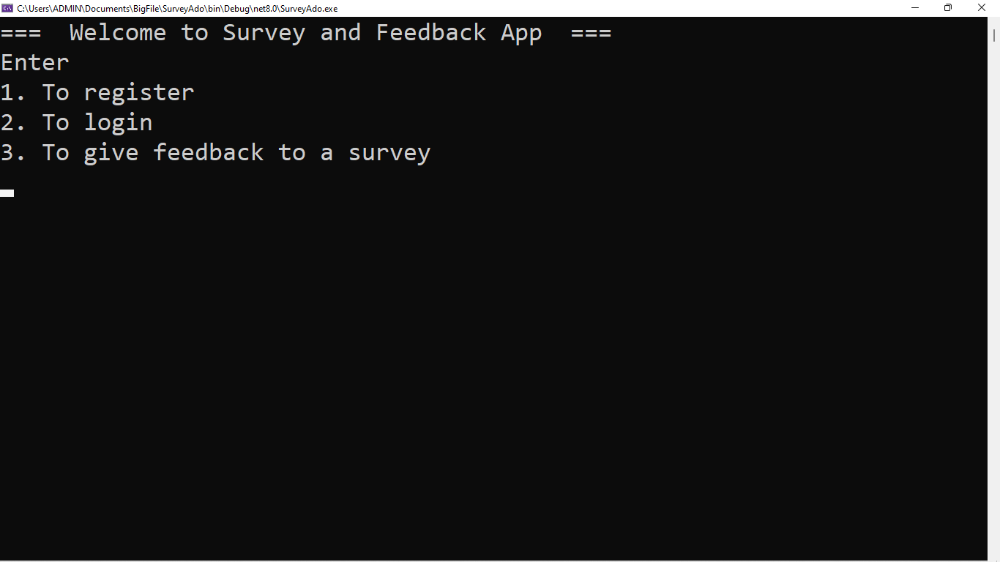
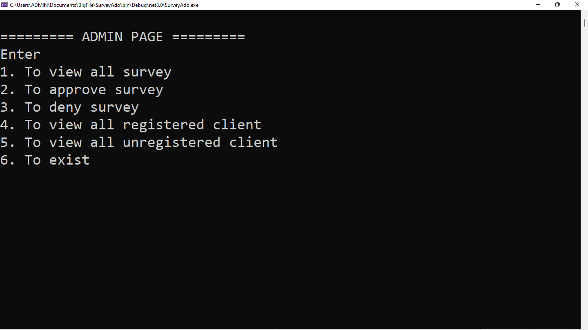
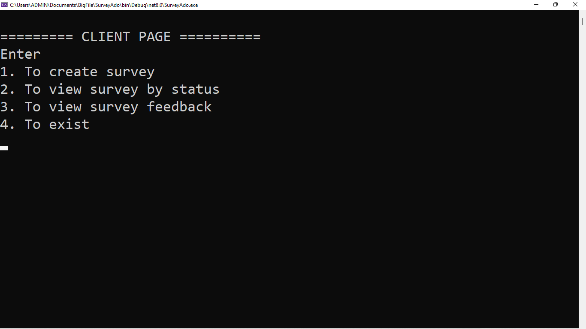

# Survey and feedback Application

## Description

I built this console survey application using Ado .Net and MySql as database. 
## Features  
<ul>
   <li>The scope of the application allows an admin to view all users of the application, approve survey and disapprove survey</li>
  <li>The scope of the application allows a user to create a survey, but the survey have to be approved by the admin first before other users can have access to the              survey</li>
  <li>A user can check if his survey have been approved by an admin or rejected, and if approved other users can give response to the survey</li>
  <li>A user can check feedback given on a survey the user created</li>
<\ul>

###Screenshot of Landing page

###Screenshot of Admin Menu

###Screenshot of User Menu

